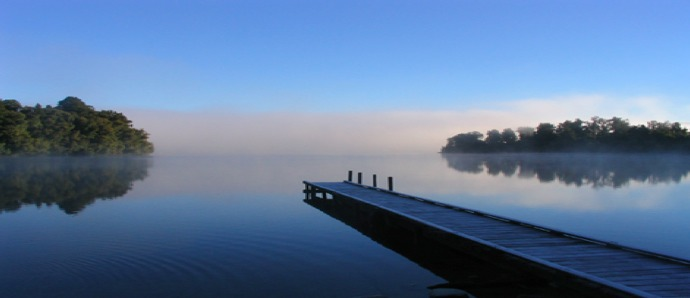

# Image Filtering using CUDA

This is the implementation of image filters, including Box Filter, Median Filter, Sobel Filter, Laplacian Filter, Sharpenning Filter, TV Filter, Prewitt Filter, ect using CUDA on GPU. I also implemented these filters using C++ and OpenCV.

Example of the input image and resulted image after filtering:


Original image:
<p align="center">
  
</p>

Filtered image by Box filtering:
<p align="center">
  
</p>

Filtered image by Laplacian filtering:
<p align="center">
  
</p>

Filtered image by Sobel filtering:
<p align="center">
  
</p>

Build (rework):
```bash
mkdir build && cd build
cmake ..
make -j
./pixelfx_gui
